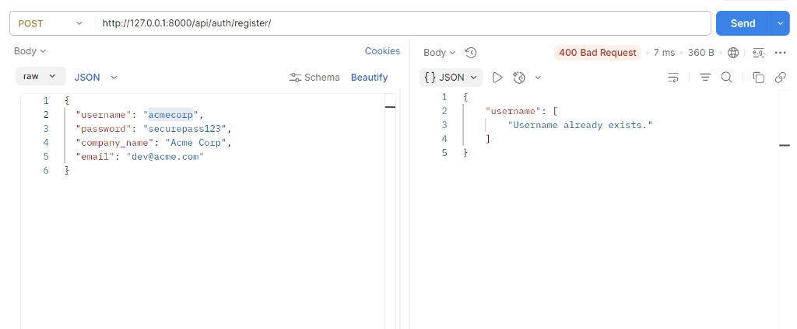
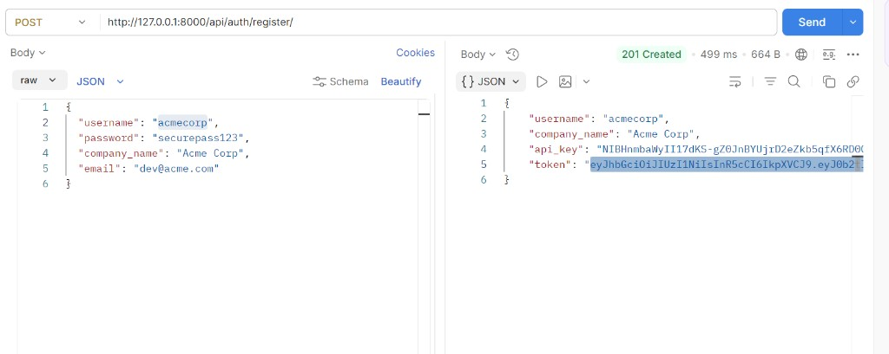
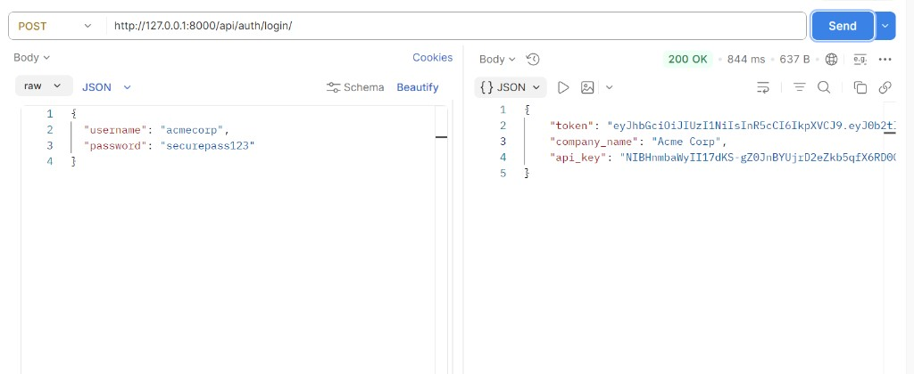
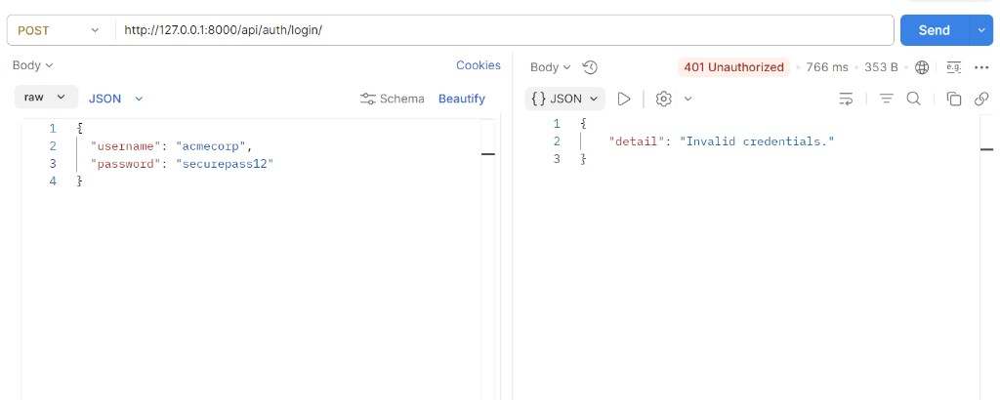
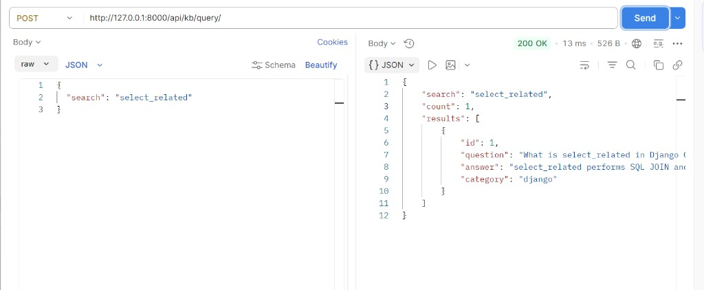
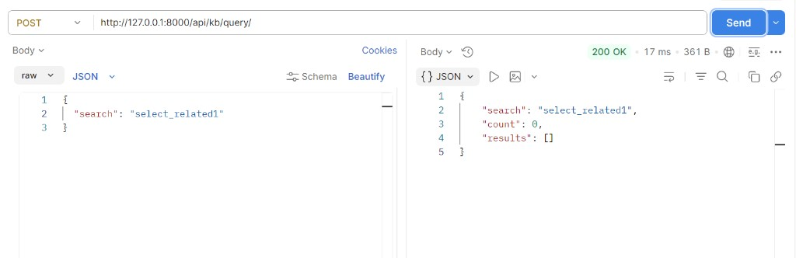
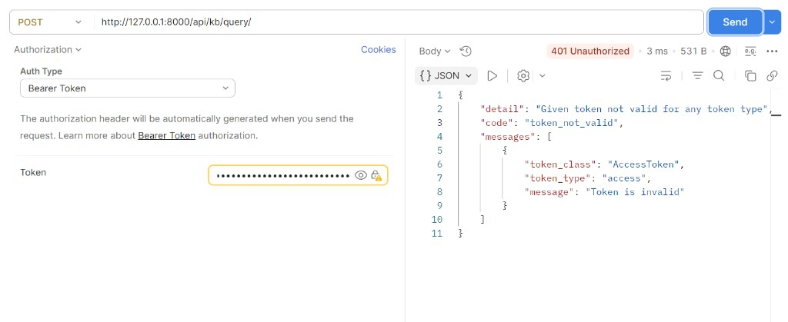
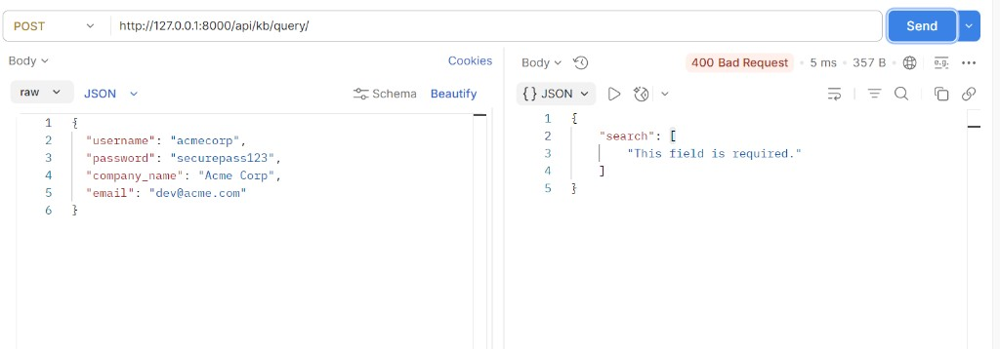
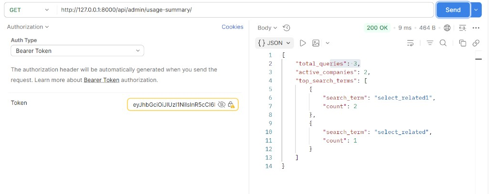
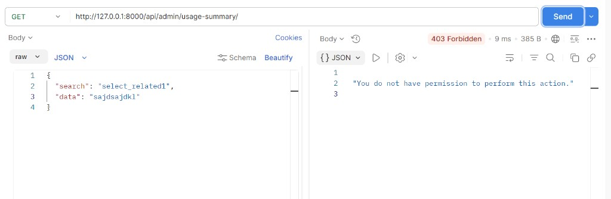

# EventHub Knowledge API

This project implements the backend task for a multi-tenant knowledge base API.

## Stack

- Python 3.12
- Django
- Django REST Framework
- Simple JWT (`djangorestframework-simplejwt`)

## Run Locally

```bash
python -m venv .venv
```

Windows PowerShell:

```powershell
.\.venv\Scripts\Activate.ps1
```

Install dependencies:

```bash
pip install -r requirements.txt
```

Apply migrations:

```bash
python manage.py makemigrations
python manage.py migrate
```

Load sample KB data (10 entries):

```bash
python manage.py loaddata eventhub/fixtures/kb_entries.json
```

Run server:

```bash
python manage.py runserver
```

Base URL: `http://127.0.0.1:8000`

## Models Implemented

- `Company` (OneToOne with `User`): `company_name`, `api_key`, `role`, `created_at`
- `KBEntry`: `question`, `answer`, `category`, `created_at`
- `QueryLog`: `company`, `search_term`, `result_count`, `queried_at`

## API Endpoints

### `POST /api/auth/register/`

Public endpoint to register a company user.  
Returns JWT token and auto-generated API key.

Request:

```json
{
  "username": "acmecorp",
  "password": "securepass123",
  "company_name": "Acme Corp",
  "email": "dev@acme.com"
}
```

Success response (`201`):

```json
{
  "username": "acmecorp",
  "company_name": "Acme Corp",
  "api_key": "auto-generated",
  "token": "jwt-access-token"
}
```

### `POST /api/auth/login/`

Public endpoint to login and receive a fresh JWT token.

Request:

```json
{
  "username": "acmecorp",
  "password": "securepass123"
}
```

Success response (`200`):

```json
{
  "token": "jwt-access-token",
  "company_name": "Acme Corp",
  "api_key": "same-api-key"
}
```

### `POST /api/kb/query/`

Protected endpoint (JWT required).  
Searches `question` + `answer` using case-insensitive contains (`icontains`) and logs every query.

Headers:

```text
Authorization: Bearer <token>
```

Request:

```json
{
  "search": "select_related"
}
```

Success response (`200`):

```json
{
  "search": "select_related",
  "count": 2,
  "results": [
    {
      "id": 1,
      "question": "What is select_related in Django ORM?",
      "answer": "select_related performs a SQL JOIN...",
      "category": "django"
    }
  ]
}
```

### `GET /api/admin/usage-summary/`

Protected admin-only endpoint.  
Returns total queries, active companies, and top 5 search terms.

Response (`200`):

```json
{
  "total_queries": 24,
  "active_companies": 7,
  "top_search_terms": [
    {
      "search_term": "select_related",
      "count": 12
    }
  ]
}
```

Client token receives `403 Forbidden`.

## Design Decision

I used `request.user.company` as the source of company identity in protected endpoints.  
This avoids trusting any company/company_id from request body and ensures queries are logged against the authenticated tenant only.

## Postman Snapshots

All snapshots are stored in `docs/images/postman-eventhub/`.

### Auth

- Register success (`201`)  
  
- Register duplicate username (`400`)  
  
- Login success (`200`)  
  
- Login invalid password (`401`)  
  

### KB Query

- Query success with results (`200`)  
  
- Query success with no results (`200`)  
  
- Query with invalid token (`401`)  
  
- Query missing required `search` (`400`)  
  

### Admin Usage Summary

- Admin token success (`200`)  
  
- Client token forbidden (`403`)  
  
