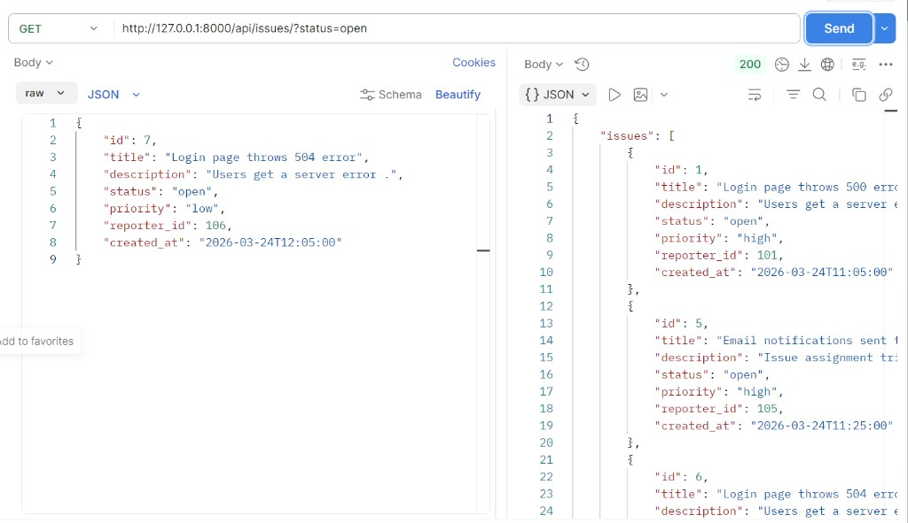
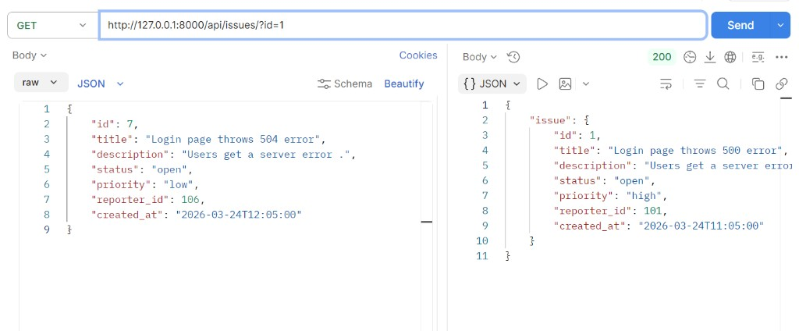
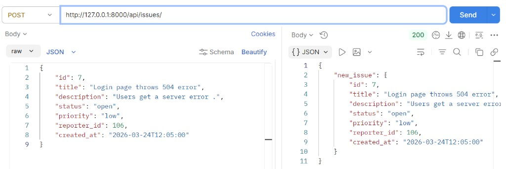
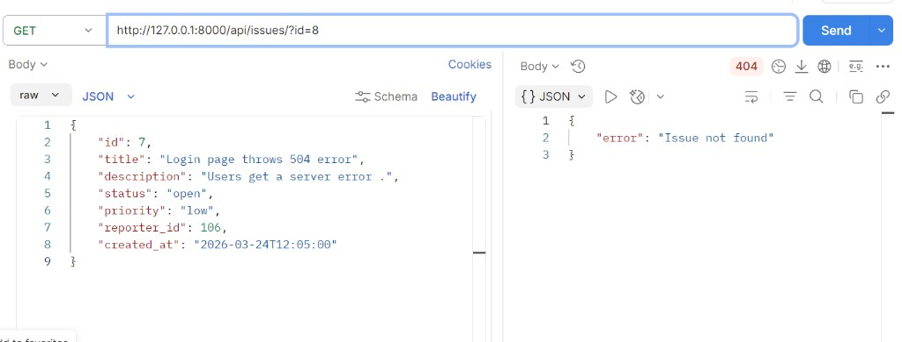

# Python Assignment - Issues API

Simple Django + DRF API that reads/writes issues from `issues.json`.

## How To Run The Project

1. Clone the repo and open terminal in project root.
2. Create virtual environment (if not created yet):
   - `python -m venv .venv`
3. Activate venv (Windows PowerShell):
   - `.\.venv\Scripts\Activate.ps1`
4. Install dependencies:
   - `python -m pip install -r requirements.txt`
5. Start server:
   - `python manage.py runserver`

Server URL: `http://127.0.0.1:8000/`

## API Endpoints

Base path: `/api/issues/`

### 1) Get all issues

- **Method:** `GET`
- **URL:** `http://127.0.0.1:8000/api/issues/`
- **What it does:** Returns the full list from `issues.json`.

### 2) Get issue by id

- **Method:** `GET`
- **URL:** `http://127.0.0.1:8000/api/issues/?id=1`
- **What it does:** Returns one issue matching `id`.

### 3) Filter issues by status

- **Method:** `GET`
- **URL:** `http://127.0.0.1:8000/api/issues/?status=open`
- **What it does:** Returns all issues where status equals provided value.

### 4) Create new issue

- **Method:** `POST`
- **URL:** `http://127.0.0.1:8000/api/issues/`
- **Body (JSON):**

```json
{
  "id": 7,
  "title": "Login page throws 504 error",
  "description": "Users get a server error.",
  "status": "open",
  "priority": "low",
  "reporter_id": 106,
  "created_at": "2026-03-24T12:05:00"
}
```

- **What it does:** Appends the new issue to `issues.json` and returns created object.
- We are not using any models here as the topic is not yet done.

## Design Decision

I kept both `GET` and `POST` on the same endpoint (`/api/issues/`) and routed logic by HTTP method inside one view function.

**Why:**  
This keeps the API simple and REST-style:
- same resource path for read/create
- less URL duplication
- easier testing in Postman

## Postman Testing Evidence

### Success screenshots

1. **GET filtered list (`status=open`)**



2. **GET by id (`id=1`)**



3. **POST create issue**



### Failure example (endpoint tested)

- **Endpoint:** `GET /api/issues/?id=9999`
- **Expected result:** `{"error": "Issue not found"}`


