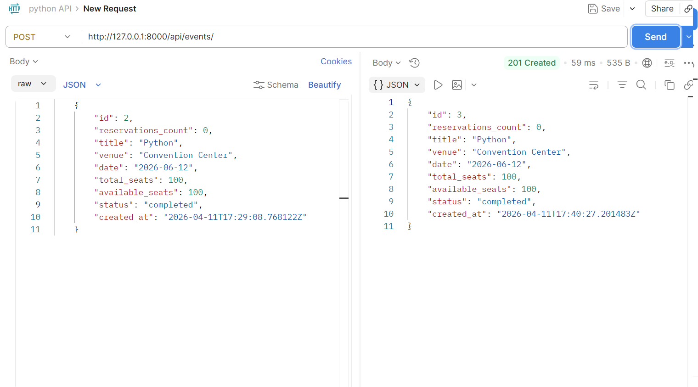
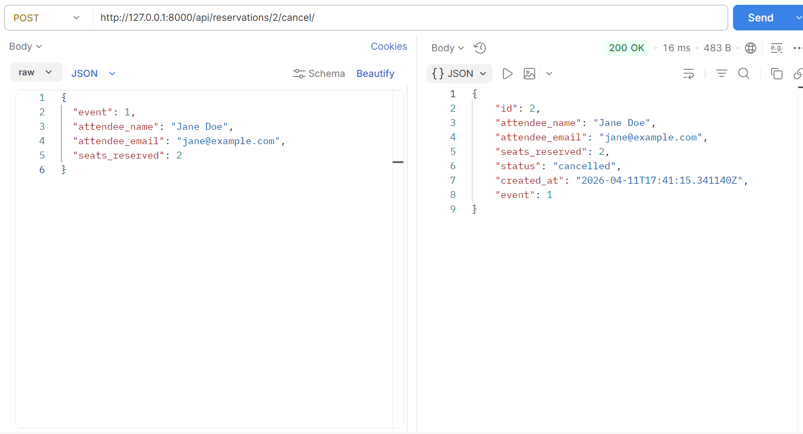
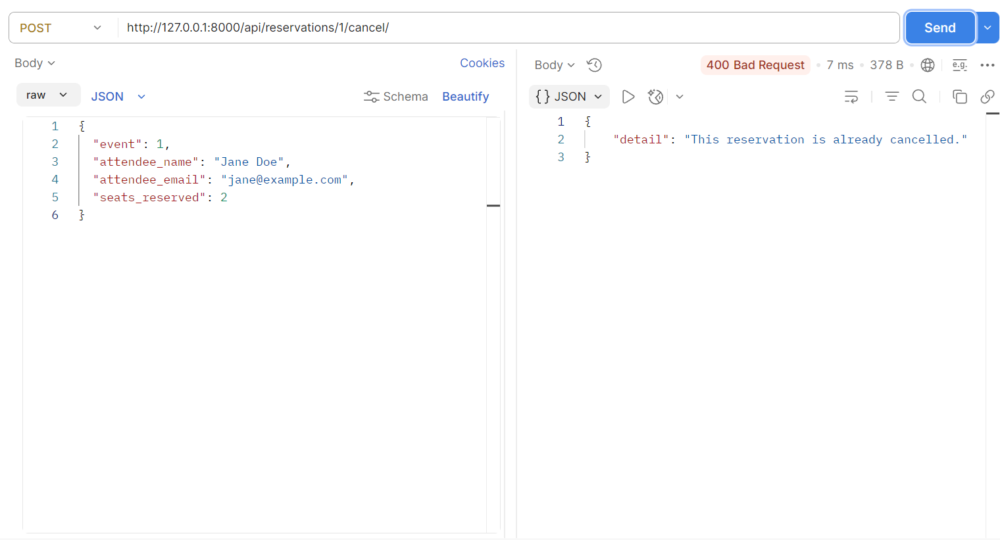

# EventHub - Event Ticketing API

A Django REST API where you can create events, book seats, and cancel reservations.

## How to Run

```
python -m venv .venv
.\.venv\Scripts\Activate.ps1
pip install -r requirements.txt
python manage.py migrate
python manage.py runserver
```

Server runs at `http://127.0.0.1:8000/`

## Endpoints

### Events

- `GET /api/events/` - get all events
- `POST /api/events/` - create an event
- `GET /api/events/1/` - get one event
- `PUT /api/events/1/` - update an event
- `DELETE /api/events/1/` - delete an event
- `GET /api/events/?status=upcoming` - filter by status
- `GET /api/events/?venue=hall` - search by venue name

### Reservations

- `GET /api/reservations/` - get all reservations
- `POST /api/reservations/` - book seats for an event
- `GET /api/reservations/1/` - get one reservation
- `DELETE /api/reservations/1/` - delete a reservation
- `GET /api/reservations/?event_id=1` - filter by event
- `POST /api/reservations/1/cancel/` - cancel a booking (gives seats back)

## Sample Request - Create Event

```json
POST /api/events/
{
  "title": "Django Conference",
  "venue": "Convention Center",
  "date": "2026-06-15",
  "total_seats": 100,
  "available_seats": 100
}
```

## Sample Request - Book Seats

```json
POST /api/reservations/
{
  "event": 1,
  "attendee_name": "Jane Doe",
  "attendee_email": "jane@example.com",
  "seats_reserved": 2
}
```

## Design Decision

I used `select_for_update()` with `transaction.atomic()` when booking seats. This locks the event row in the database so if two people try to book the last seat at the same time, only one gets it. Without this, both could succeed and seats would go negative.

## Postman Screenshots

### Create Event (201 Created)



### Successful Cancellation (200 OK)



### Already Cancelled (400 Bad Request)


