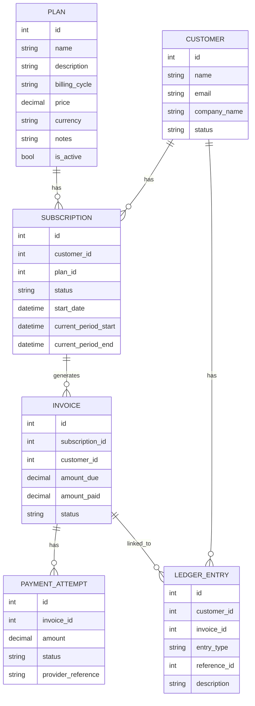

# SubLedger — Low-Level Design

This document explains how I designed the project before writing the code.

## 1. ERD (Entity Relationship Diagram)



## 2. Project structure

```
routes/        → receives HTTP request, calls service
services/      → business rules live here
repositories/  → database read/write only
models/        → SQLAlchemy tables
schemas/       → request/response JSON shapes (Pydantic)
```

**Rule I followed:** routes should stay thin. If a rule is about money or subscriptions, it goes in a service — not in the route.

## 3. Design pattern used

**Repository Pattern + Service Layer**

- Repositories only talk to the database.
- Services contain the actual business logic.
- Routes just pass data in and out.

This makes testing easier because I can test business rules without hitting HTTP.

## 4. Service responsibility table

| Service | What it does |
|---------|--------------|
| `PlanService` | Create/update plans, check price > 0 |
| `CustomerService` | Create customers, check unique email |
| `SubscriptionService` | Create/cancel subs, block inactive plan, block duplicate active sub |
| `InvoiceService` | Generate invoice, set amount from plan price, write ledger entry |
| `PaymentService` | Record payment, update invoice status |
| `LedgerService` | Append-only ledger entries |

## 5. Repository responsibility table

| Repository | What it does |
|------------|--------------|
| `PlanRepository` | CRUD for plans table |
| `CustomerRepository` | CRUD for customers table |
| `SubscriptionRepository` | CRUD + check active subscription exists |
| `InvoiceRepository` | CRUD for invoices |
| `PaymentAttemptRepository` | Save payment attempts |
| `LedgerRepository` | Create + read ledger rows only (no update/delete) |

## 6. Business rule ownership

| Rule | Where it is enforced |
|------|----------------------|
| Plan price > 0 | `PlanService` + Pydantic schema |
| Customer email unique | `CustomerService` + DB unique constraint |
| No sub on inactive plan | `SubscriptionService` |
| One active sub per customer+plan | `SubscriptionService` |
| Invoice amount from plan price | `InvoiceService` |
| Payment cannot exceed remaining | `PaymentService` |
| Paid / partially_paid status | `PaymentService` |
| Failed payment does not change amount_paid | `PaymentService` |
| Ledger is append-only | `LedgerService` / `LedgerRepository` |

## 7. Invoice generation flow

1. `POST /api/invoices/generate` receives `subscription_id`
2. `InvoiceService` loads subscription from `SubscriptionRepository`
3. Check subscription is `active`
4. Load plan and read current `price`
5. Create invoice with `amount_due = plan.price`
6. `LedgerService` writes `invoice_created` entry
7. Return invoice JSON

## 8. Payment recording flow

1. `POST /api/payments/record` receives payment details
2. `PaymentService` loads invoice
3. If status is `success`, check amount <= remaining balance
4. Save `PaymentAttempt`
5. If success → update `amount_paid` and invoice status
6. If failed → do **not** change `amount_paid`
7. Write ledger entry (`payment_success` or `payment_failure`)
8. Return payment + updated invoice status

## 9. What I intentionally kept simple

- No real payment provider integration
- No authentication
- No tax or refund logic
- Subscription becomes active immediately on create (no separate activate step)

These are listed as assumptions in README.md.
